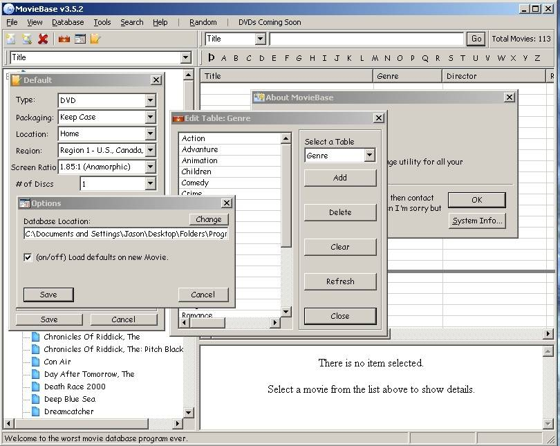



## MovieBase v3\.1

### Description

An easy to use movie database program. If you have alot of movies then this is for you. To run you will need 2 different ocx's. 1) FlatButton V1.1 By: Wayne Hartell http://www.planet-source-code.com/vb/scripts/ShowCode.asp?txtCodeId=10646&lngWId=1

and 2) HookMenu 1.5 By: NR/GN http://planet-source-code.com/vb/scripts/ShowCode.asp?txtCodeId=49985&lngWId=1

Please note the hookmenu it not required to run all it does is add images to the menu. So enjoy.
 
### More Info
 

             |
---                |---
**Submitted On**   |2005-04-04 18:42:24
**By**             |[JScott3D](https://github.com/Planet-Source-Code/PSCIndex/blob/master/ByAuthor/jscott3d.md)
**Level**          |Intermediate
**User Rating**    |4.8 (24 globes from 5 users)
**Compatibility**  |VB 5\.0, VB 6\.0
**Category**       |[Complete Applications](https://github.com/Planet-Source-Code/PSCIndex/blob/master/ByCategory/complete-applications__1-27.md)
**World**          |[Visual Basic](https://github.com/Planet-Source-Code/PSCIndex/blob/master/ByWorld/visual-basic.md)
**Archive File**   |[MovieBase\_187295462005\.zip](https://github.com/Planet-Source-Code/jscott3d-moviebase-v3-1__1-59835/archive/master.zip)

